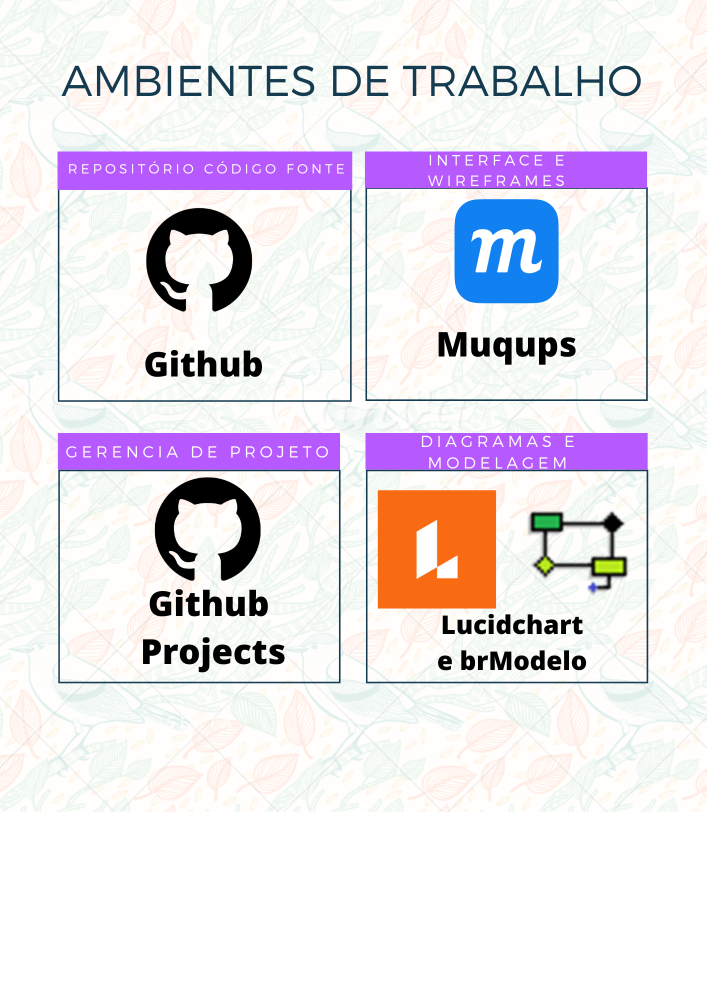

# Metodologia

A metodologia a ser utilizada é de metodologia agil(SCRUM) onde toda entrega é com transparência, uma inspeção constante de tudo que está sendo feito aos poucos. Ambiente de trabalho é de reuniões realizada pela equipe via Teams para esclarecimento de dúvidas, sugestões para o projeto e apresentações dos artefatos. Sendo todo o código fonte trabalhado no repositório Github, desde a criação de sprints até as próprias representações do projeto, usando como base toda as prioridades dos requisitos citados na Especificação do Projeto. Ambientes de trabalho em geral serão descritos abaixo:

## Ambientes de trabalho:
Os ambientes de trabalho utilizados e onde serão produzidos os artefatos do projeto serão conforme indica a imagem abaixo:

## Gestão do Código Fonte:
A gestão se da por manutenções e opiniões serão realizadas pela equipe ou desenvolvedor separadas em branches pelo próprio GitHub onde passa por partes de análise e discussão para o merge e commit serem realizados.

## Gerenciamento de Projeto
Utilizando metodologias ágeis conforme o scrum, a equipe de projeto ficou dividida em:
#### Scrum Master: 
- Letícia Amorim Costa
#### Product Owner: 
- Ayrles Alves De Lima Sales
#### Equipe de desenvolvimento:
- Bruno Roberto Olympio Ferreira
- Leonardo Moreira Franco De Souza
- Guilherme Servelo Da Costa
#### Equipe de Design:
- Lia Araruna De Lima
- Leandro Furtado de Sousa

Sendo então divido as tarefas e organizadas pelo próprio time, onde encontramos:
- Product Backlog: Local onde todas as funcionalidades da aplicação se encontra e que serão realizadas ao decorrer do projeto.
- To do: Local que é usado como as Sprints Backlogs.
- In Progress: Tudo que está sendo realizado no momento.
- Done: Tudo que já foi feito desde o inicio.
Sendo também possível a inserção de novas colunas ao decorrer do projeto.

### Ferramentas
As ferramentas empregadas no projeto são:

- Editor de código (VS Code).
- Microsoft Teams e Discord para reuniões diárias, por serem mais didáticos, organizados e simples ao mesmo tempo e no caso do Teams gravar as reuniões.
- Ferramentas de desenho de tela, diagrama e modelagens(Lucidchart, Moqups e brModelo).
- Ferramentas do Github
