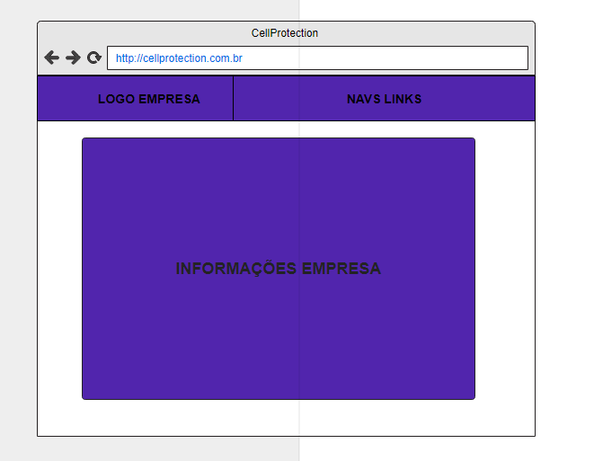
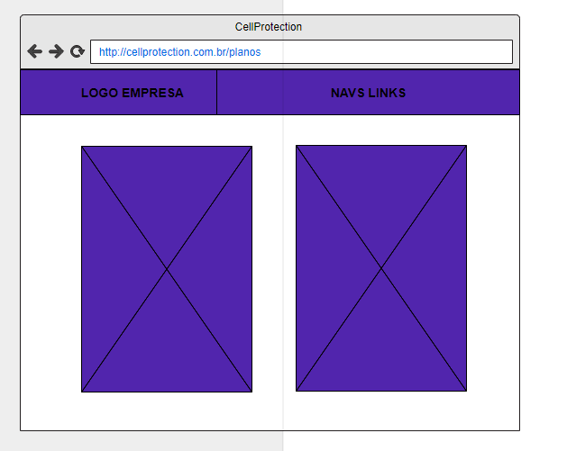
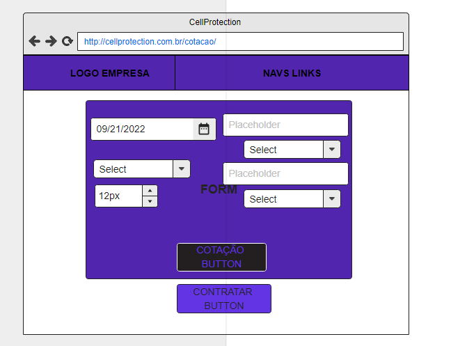
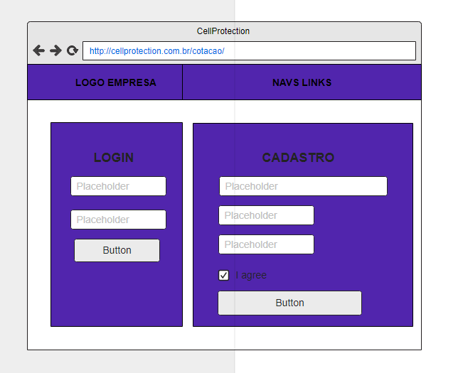
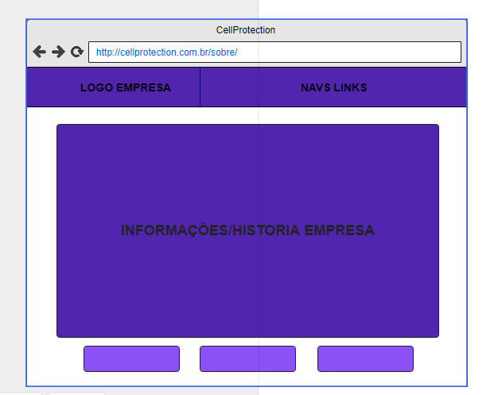
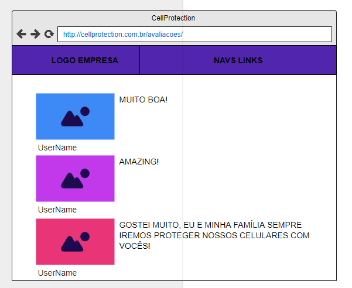
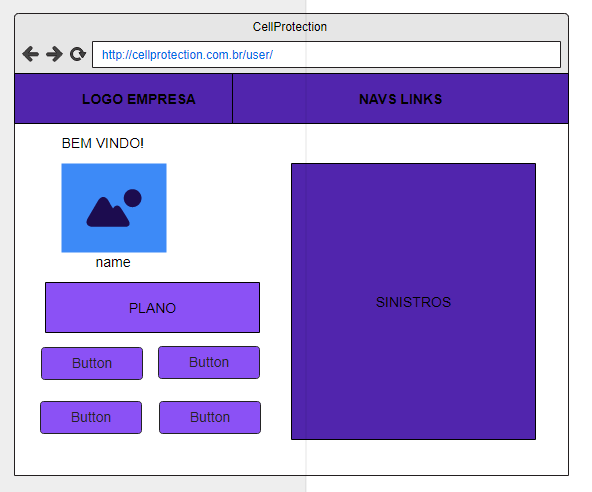

# Projeto de Interface

Dentre as preocupações para a montagem da interface do sistema, estamos estabelecendo foco em questões como agilidade, acessibilidade e usabilidade. Desta forma, o projeto tem uma identidade visual padronizada em todas as telas que são projetadas para funcionamento em desktops e dispositivos móveis.

## Diagrama de Fluxo

O diagrama de fluxo apresentado na Figura abaixo mostra o fluxo de interação do usuário pelas telas do sistema. Cada uma das telas deste fluxo é detalhada na seção de Wireframes que se segue. 

## Wireframes

### **Tela - Home-Page**

A tela Home-Page irá concentrar a maior parte das funcionalidades da aplicação web. Pensando em um novo cliente, no topo da tela teremos um cabeçalho com o logo da empresa, uma barra de Menu que direciona as demais telas do site e o conteúdo central a ser apresentado de acordo com o Menu acessado. 

> **Body da Home-Page - Breve apresentação da empresa**

- Nessa primeira parte faremos uma breve apresentação da empresa com imagens e pouco texto, focando em que tipos de soluções a empresa de proteção fornece, as   facilidades de acesso e adesão, do suporte, da qualidade e do foco no cliente. Em outras palavras, seria um cartão de visitas e convite à adesão da pessoa que está visualizando.

**Tela - Planos de proteção**

É possível ver os planos que podem ser adquiridos pelo usuário.

> **Opção de proteção para o seu smartphone**
- Furto
- Roubo
- Vidros trincados
- Quebra em geral

**Tela - Cotação**

Ao clicar no botão abrirá um formulário para preenchimento com opções de marcar, para digitar os dados do cliente e de seu aparelho.

- Botão para cotar: Apartir dos dados fornecidos o sistema vai gerar um valor para o seguro em mensalidade, já com os valores dos opcionais agregados.

- Botão para contratação: Após a cotação o cliente já pode contratar o serviço. (Caso o cliente não esteja logado um pop-up é aberto com a opção de login/cadastro)

**Tela - Login/Cadastro**

Pode ser acessada pela barra no cabeçalho da tela ou vir através da tela de cotação.

- Nesta tela você tem os campos para logar com email e senha e os campos para realizar um cadastro no site.
- Após clicar em logar, você será redirecionado para área do cliente.

**Tela - Sobre a empresa**

Nesta tela terá uma apresentação completa da empresa, contemplando visão, missão e valores da mesma.

- Contém alguns botões, mas o principal é o que redireciona para página de avaliações da empresa.

**Tela - Avaliações da empresa**

Esta tela não terá nenhum componente que o cliente possa interagir (somente um botão redirecionando para a tela para que o mesmo possa fazer uma avaliação dos serviços por ele contratado), ela vai ter recortes das avaliações feitas por clientes que já aderiram e utilizaram do serviços fornecidos pela empresa. Essencialmente terá uma foto, um comentário e a nota dada.

**Tela - Área do Cliente**

A tela Área do cliente contém algumas opções importantes, como a emissão de boletos, atualização de dados, informações sobre o plano contratado e situação de sinistros. Contém um botão com o redirecionamento para tela de realização de avaliações sobre o plano contratado.

- Botão de imprimir segunda via de boletos.
- Botão de atualização de dados contendo um formulário para a inserção dos novos dados.
- Tela lateral com as informações do plano contratado.
- Botão de redirecionamento para a realização de avaliações.
- Situação do sinistros (SE HOUVER)
